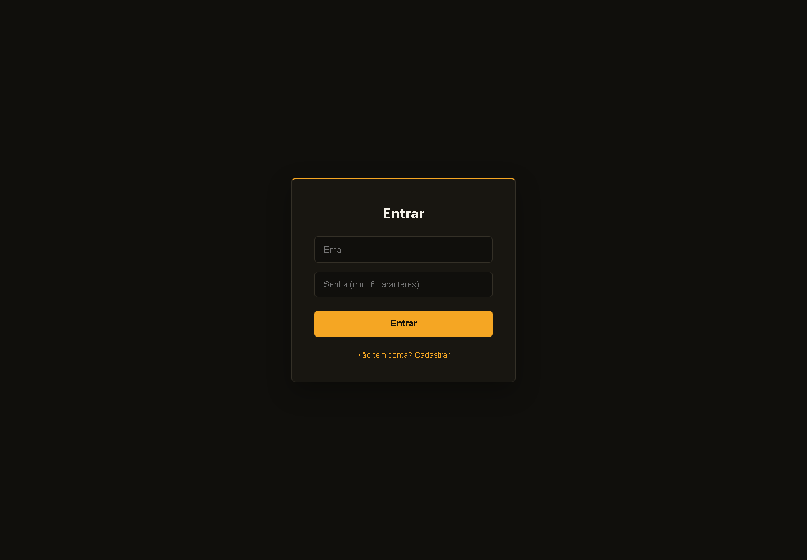
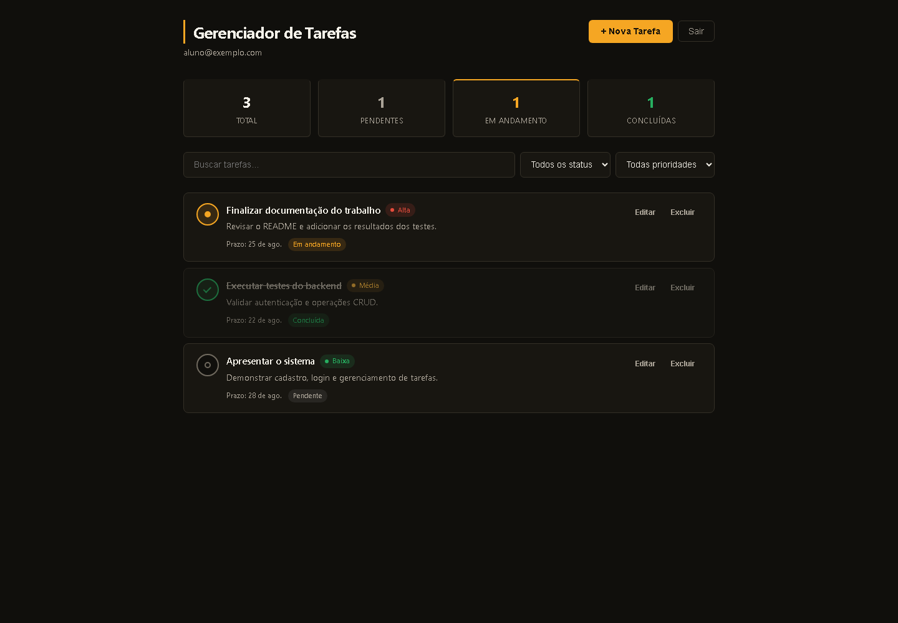

# Gerenciador de Tarefas Distribuído

Trabalho de Sistemas Distribuídos: aplicação web com cliente e servidor
separados. Usuários autenticados por email e senha gerenciam somente as tarefas
associadas às próprias contas.

## Funcionalidades

- Cadastro, login, consulta de sessão e logout com Supabase Auth.
- Criação, listagem, atualização e exclusão de tarefas por API REST.
- Título obrigatório, descrição, data limite, prioridade e status.
- Prioridades baixa, média e alta.
- Status pendente, em andamento e concluída.
- Proteção de rotas no cliente e autorização em todos os endpoints de tarefas.
- Isolamento por usuário no backend e por políticas RLS no PostgreSQL.
- Busca, filtros, indicadores e mensagens visuais de sucesso ou erro.
- Testes automatizados sem dependência de um projeto Supabase real.

## Tecnologias

- Cliente: React 19, TypeScript e Vite.
- Servidor: Python, FastAPI e Uvicorn.
- Banco e autenticação: Supabase (PostgreSQL + Auth).
- Testes: Pytest e `TestClient` do FastAPI.

## Estrutura do código

```text
trab1-sd/
├── client/                     # Aplicação React + Vite
│   ├── public/
│   └── src/
│       ├── components/         # Modal, formulário e rota protegida
│       ├── contexts/           # Estado de autenticação
│       ├── lib/                # Cliente da API REST
│       └── pages/              # Login e painel de tarefas
├── server/                     # API FastAPI
│   ├── tests/                  # Testes de auth, CRUD e isolamento
│   ├── main.py                 # Rotas, schemas e autorização
│   ├── requirements.txt        # Dependências Python fixadas
│   └── supabase_migration.sql  # Tabelas, relacionamentos e RLS
├── docs/screenshots/           # Prints da interface
└── README.md
```

## Pré-requisitos

- Node.js 20.19 ou superior (ou 22.12 ou superior).
- Python 3.11 ou superior.
- Conta e projeto gratuitos no Supabase.

## Configuração do Supabase

1. Crie um projeto no Supabase.
2. Abra o SQL Editor e execute todo o conteúdo de
   `server/supabase_migration.sql`.
3. Copie `server/.env.example` para `server/.env`.
4. Preencha `SUPABASE_URL` e `SUPABASE_SERVICE_ROLE_KEY` com os valores do
   projeto.

> A chave `service_role` é secreta. Ela deve permanecer somente no servidor e
> nunca deve ser enviada ao GitHub ou incluída no cliente React.

Opcionalmente, copie `client/.env.example` para `client/.env` para alterar o
endereço da API. O valor padrão é `http://localhost:8000/api`.

## Instalação

### Servidor - Windows PowerShell

```powershell
cd server
python -m venv venv
.\venv\Scripts\Activate.ps1
python -m pip install -r requirements.txt
```

### Servidor - Linux/macOS

```bash
cd server
python3 -m venv venv
source venv/bin/activate
python -m pip install -r requirements.txt
```

### Cliente

```bash
cd client
npm ci
```

## Execução

Inicie o servidor em um terminal:

```bash
cd server
uvicorn main:app --reload
```

Em outro terminal, inicie o cliente:

```bash
cd client
npm run dev
```

Acesse `http://localhost:5173`. A documentação interativa da API estará em
`http://localhost:8000/docs`.

## Endpoints principais

| Método | Rota | Descrição |
| --- | --- | --- |
| POST | `/api/auth/signup` | Cadastra um usuário |
| POST | `/api/auth/login` | Autentica por email e senha |
| POST | `/api/auth/logout` | Encerra a sessão |
| GET | `/api/auth/me` | Retorna o usuário autenticado |
| GET | `/api/tasks` | Lista somente as tarefas do usuário |
| POST | `/api/tasks` | Cria uma tarefa |
| PUT | `/api/tasks/{id}` | Atualiza uma tarefa do usuário |
| DELETE | `/api/tasks/{id}` | Exclui uma tarefa do usuário |

## Testes do backend

As dependências de teste estão incluídas em `server/requirements.txt`.

```bash
cd server
python -m pytest -q
```

Foram implementados **35 testes automatizados**, organizados nos seguintes
grupos:

- Autenticação: cadastro, duplicidade, validação, login, logout e sessão atual.
- Autorização: ausência de token, token inválido e acesso protegido.
- Criação: dados mínimos e completos, valores padrão e validação do título.
- Listagem: lista vazia, múltiplas tarefas e autenticação obrigatória.
- Atualização: título, prioridade, status, vários campos e tarefa inexistente.
- Exclusão: remoção, tarefa inexistente e autenticação obrigatória.
- Isolamento: um usuário não pode listar, alterar ou excluir tarefas de outro.

Resultado obtido em 20/08/2026:

```text
...................................                                      [100%]
35 passed, 1 warning in 0.90s
```

O aviso é uma depreciação interna da integração `TestClient`/`httpx` e não
representa falha dos testes.

## Verificações do cliente

```bash
cd client
npm run lint
npm run build
```

Resultados obtidos em 20/08/2026:

- Lint concluído sem erros ou avisos.
- Build TypeScript/Vite concluído com sucesso.
- Auditoria das dependências: 0 vulnerabilidades encontradas.

## Prints da interface

### Login e cadastro



### Painel e lista de tarefas


